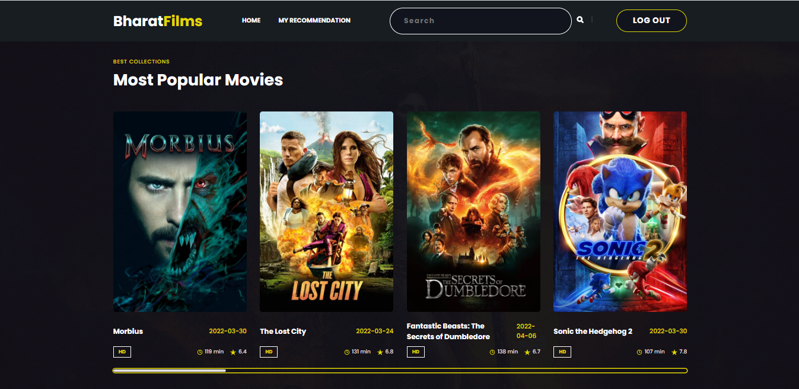

# Content and Collaborative Based Movie Recommender System
#### Video Demo
> (https://youtu.be/M7z_nLl7zk0)

---

### About
A Web Application of Movie <b>Recommendation Engine</b> based on <b>content based, item-item (using Collaborative Filtering) and KNN algorithm</b>. This application will provide all the information related to that movie and the most interesting part, this application will provide you the top <b>movie recommendations</b> based on your search. The user has to first register and login into the application.
<b>HTML, CSS, JS</b> were used for frontend which was deployed using <b>firebase hosting</b> to serve the machine learning models to the Frontend.
This application uses <b>Content Based, item-item, KNN algorithms</b> to recommend movies to the user.<b>TMDB</b> API was used to retrieve all the information related to the movie and its cast. Here, feature extraction methods and distance metrics are utilised to generate recommendations. 

---

### Key Features 📋
* Recommendation on basis of content like genres, title, and cast, crew.
* User can get movie recommendation (Recommendation algorithm of Collaborative Filtering which suggests new movies based on the ratings given by user).
* Recommendation on basis of KNN algorithm
* Show all details and information related to searched movie
* User can give rating to the movie
* Auto Suggestions in searched box by JavaScript
* Show Poster and Video of that movie using tmdb API
* Show Trending, Top rated, Kids movies rows
* User can Register and Login inside website

---

### Website Preview
#### Home Page

#### Detail Page

#### List Page

----

### Installation 📦
>pip install -r requirements.txt

#### Clone
- Clone this repo to your local machine.

#### How to run the project?
1. Clone or download this repository to your local machine.
2. Install all the libraries mentioned in the [requirements.txt] file with the command `pip install -r requirements.txt`
3. (Optional, DO only if you not able to get real movie posters and real movie details) Get your my_api from https://www.themoviedb.org/. (Refer the below section on how to get the API key)
3. (Optional, Do only If you not able to get real movie posters and real movie details) Replace my_api in **both** the files of `static/api.js` (line no 2) and `app.py` (line no 37) hit save.
4. Open your terminal/command prompt from your project directory and run the file `app.py` by executing the command `python app.py`.
5. Go to your browser and type `http://127.0.0.1:5000/` in the address bar.
6. Hurray! That's it.

#### How to get the API key?
Create an account in https://www.themoviedb.org/, click on the `API` link from the left hand sidebar in your account settings and fill all the details to apply for API key. If you are asked for the website URL, just give "NA" if you don't have one. You will see the API key in your `API` sidebar once your request is approved.

---

### Technologies Used

#### Web Technologies
HTML , CSS , JavaScript , Flask , Python , Machine Learning

#### Machine Learning Library In Python3
Numpy , Pandas , Scipy

#### Database
Firebase

---

### Algorithms Used
#### Content Based Filtering Method
Feature extraction methods such as TF-IDF vectorises the text data and distance metrics such as Cosine Similarity computes the similarity between each item by calculating the distance between each vector.

#### Collaborative Filtering (item-item) Method
In general itemitem collaborative filtering worked better than useruser collaborative filtering, irrespective of the similarity function used. This is possibly because itemitem collaborative filtering is more resistant towards user bias. Comparing the similarity functions, it was observed the plain, cosine similarity tends to work better than pearson correlation, for sparse matrices. Tried using centered cosine, but it fails when users rate all the movies same, so dropped it. The value of nearest neighbor was chosen such that the mse loss is minimized.
    * **User-based**, which measures the similarity between target users and other users.
    * **Item-based**, which measures the similarity between the items that target users rate or interact with and other items.
    
#### Collaborative Filtering Using k-Nearest Neighbors (KNN)
Collaborative Filtering Using k-Nearest Neighbors (kNN) kNN is used to find clusters of similar users based on common movie ratings, and make predictions using the average rating of top-k nearest neighbors.
     
  ---
  
### Distance metric
The distance metric used in this recommender is Cosine Similarity. Cosine Similarity computes the similarity of items by measuring the cosine of the angle between two vectors projected in a multidimensional vector space. With Cosine Similarity, non-binary vector values are taken into consideration during calculation as the values directly influence the position of the vector. Cosine Similarity focuses on the contents of the items and disregards the size of the items. Hence, Cosine Similarity is suitable for text documents with different word counts. 

---

### Sources of the datasets 
1. [IMDB 5000 Movie Dataset](https://www.kaggle.com/carolzhangdc/imdb-5000-movie-dataset)
2. [IMDB 5000 Movie Dataset](https://www.kaggle.com/carolzhangdc/imdb-5000-credit-dataset)
3. [The Movies Dataset](https://www.kaggle.com/rounakbanik/the-movies-dataset)
